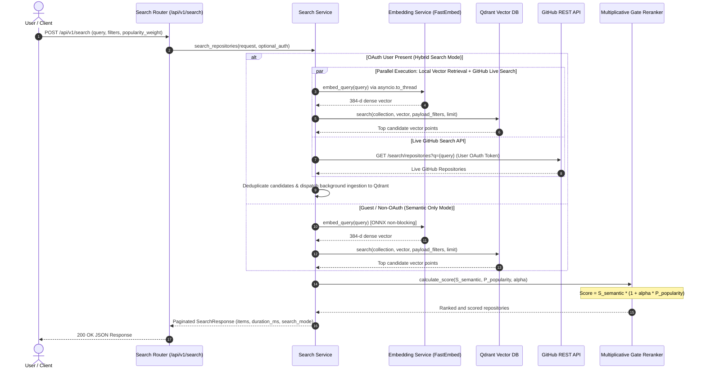
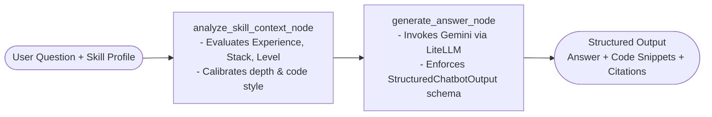
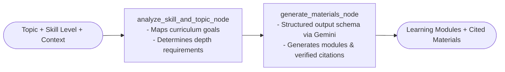
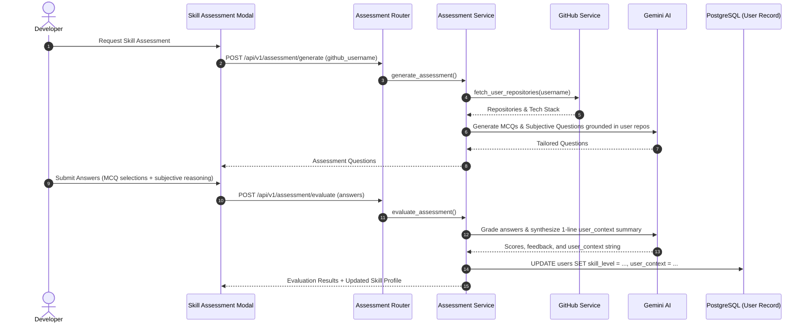
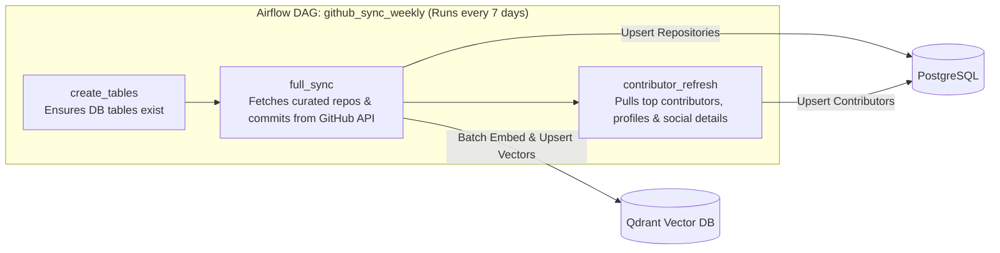
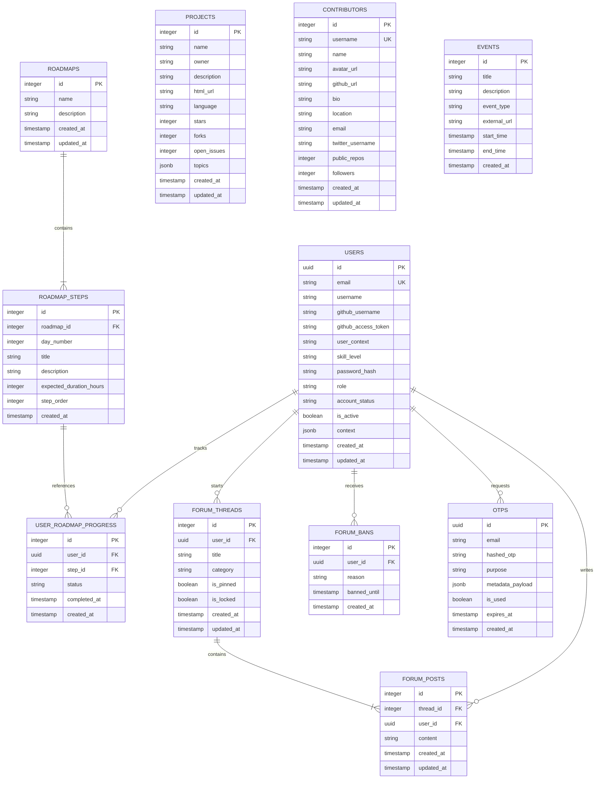
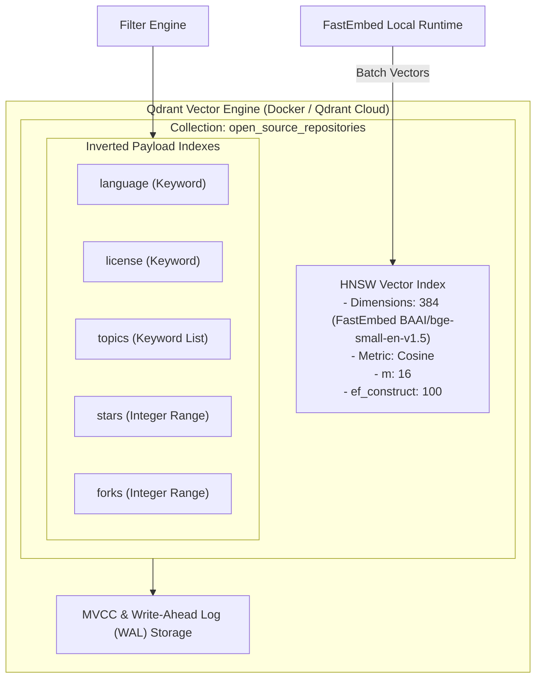
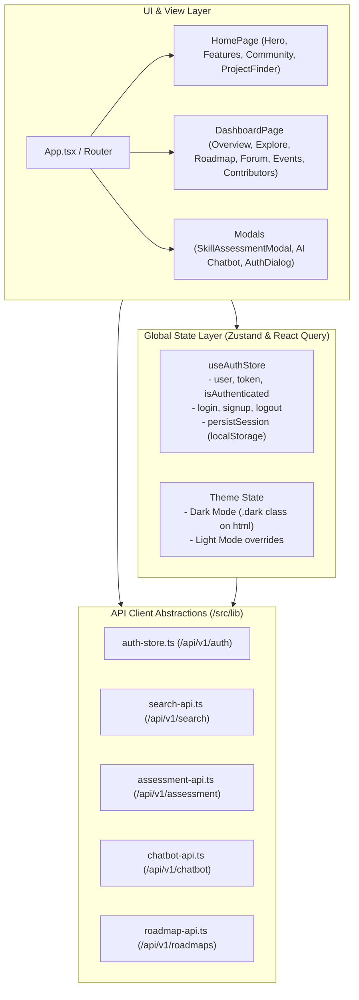

# Open Source Assist — System Architecture & Technical Design

This document details the end-to-end system architecture, component topologies, data flows, database schemas, and AI agent workflows for the **Open Source Assist** platform.

---

## 1. High-Level System Architecture

The following diagram illustrates the complete end-to-end architecture across client interfaces, API routing, business services, AI agent graphs, database engines, and external integrations.

```mermaid
flowchart TD
    %% Clients
    subgraph ClientTier["Client Tier (Frontend SPA)"]
        UI["React 18 + Vite + TypeScript"]
        Tailwind["Tailwind CSS + shadcn/ui"]
        Zustand["Zustand Stores (Auth, State)"]
        UI --- Tailwind
        UI --- Zustand
    end

    %% Gateway & API
    subgraph ApiTier["FastAPI Application Tier (Async Python 3.12)"]
        FastAPIApp["FastAPI Main App (ASGI)"]
        CORS["CORS Middleware"]
        Lifespan["Lifespan Startup & OTP Purge Task"]
        FastAPIApp --> CORS
        FastAPIApp --> Lifespan

        subgraph Routers["API Routers (/api/v1)"]
            R_Auth["Auth (/auth)"]
            R_Users["Users (/users)"]
            R_Search["Search & Ingestion (/search)"]
            R_Chatbot["AI Chatbot (/chatbot)"]
            R_Learn["AI Learning (/learning)"]
            R_Assess["Skill Assessment (/assessment)"]
            R_Projects["Projects (/projects)"]
            R_Contrib["Contributors (/contributors)"]
            R_Roadmaps["Roadmaps (/roadmaps)"]
            R_Forum["Forum (/forum)"]
            R_Events["Events (/events)"]
            R_Admin["Admin (/admin)"]
            R_Airflow["Airflow Trigger (/airflow)"]
        end
        FastAPIApp --> Routers
    end

    %% Business Services
    subgraph ServiceTier["Domain & Service Tier"]
        AuthSvc["Auth & OTP Service"]
        SearchSvc["Search & Reranking Service"]
        EmbedSvc["Embedding Service (FastEmbed ONNX)"]
        ChatbotAgent["Skill-Aware Chatbot (LangGraph)"]
        LearnAgent["Learning Materials Agent (LangGraph)"]
        AssessSvc["Skill Assessment & Context Synthesizer"]
        RoadmapSvc["Roadmap & Progress Service"]
        GithubSvc["GitHub Client & Sync Service"]
        ForumSvc["Forum & Moderation Service"]
    end

    %% Data & Orchestration
    subgraph DataTier["Data & Persistence Tier"]
        PG[("PostgreSQL 15+ (Relational DB)")]
        Qdrant[("Qdrant Vector DB (Port 6333/6334)")]
    end

    subgraph PipelineTier["Data Orchestration Tier"]
        Airflow["Apache Airflow (github_sync_weekly DAG)"]
    end

    %% External APIs
    subgraph ExternalTier["External Services"]
        GitHubAPI["GitHub REST API (v3)"]
        GeminiAPI["Google Gemini LLM (via LiteLLM)"]
        SMTP["Email / SMTP Service"]
    end

    %% Client to API
    UI -->|"HTTP REST / JSON (Axios & Fetch)"| FastAPIApp

    %% Routers to Services
    R_Auth --> AuthSvc
    R_Search --> SearchSvc
    R_Chatbot --> ChatbotAgent
    R_Learn --> LearnAgent
    R_Assess --> AssessSvc
    R_Projects --> GithubSvc
    R_Contrib --> GithubSvc
    R_Roadmaps --> RoadmapSvc
    R_Forum --> ForumSvc
    R_Airflow --> Airflow

    %% Services to Components
    SearchSvc --> EmbedSvc
    SearchSvc --> Qdrant
    SearchSvc -.->|"Hybrid Mode (OAuth Users)"| GitHubAPI
    ChatbotAgent --> GeminiAPI
    LearnAgent --> GeminiAPI
    AssessSvc --> GeminiAPI
    AssessSvc --> GithubSvc
    AuthSvc --> SMTP
    GithubSvc --> GitHubAPI

    %% Services to Databases
    AuthSvc --> PG
    RoadmapSvc --> PG
    ForumSvc --> PG
    AssessSvc --> PG
    Airflow -->|"Weekly Scheduled Sync"| GitHubAPI
    Airflow -->|"Upsert Repos & Contributors"| PG
    Airflow -->|"Vector Ingest"| Qdrant
```

---

## 2. Dual-Tier Semantic & Hybrid Search Architecture

The search engine features a dual-tier execution path optimized for both guests and authenticated GitHub users, combining dense vector embeddings with logarithmic popularity re-ranking.

### Key Concurrency Design:
1. **Zero GIL Lock**: FastEmbed runs on ONNX Runtime (C++). Wrapped in `asyncio.to_thread()`, freeing Python's event loop to handle concurrent I/O.
2. **Multiplicative Gate Formulation**:
   $$\text{FinalScore} = S_{\text{semantic}} \times \left(1 + \alpha \cdot P_{\text{popularity}}\right)$$
   Semantic relevance is mandatory (the gate); high star/fork counts cannot elevate irrelevant projects.
3. **Logarithmic Popularity Dampening**:
   $$P_{\text{popularity}} = \min\left(1.0, \frac{\log_{10}(\text{stars} + 1) + 0.5 \cdot \log_{10}(\text{forks} + 1)}{\log_{10}(\text{max\_stars} + 1) + 0.5 \cdot \log_{10}(\text{max\_forks} + 1)}\right)$$

---

## 3. LangGraph AI Agent Architectures

The platform uses **LangGraph** state machines to orchestrate structured, deterministic LLM interactions using Google Gemini and LiteLLM.

### A. Skill-Aware Chatbot Agent (`chatbot_agent.py`)

### B. Learning Materials & Citation Agent (`learning_agent.py`)

### C. GitHub-Grounded Skill Assessment & Context Synthesis

---

## 4. Airflow Data Ingestion Pipeline (`github_sync_dag.py`)

Scheduled weekly synchronization of top open-source projects, maintainers, and contributors:

---

## 5. Relational Database Schema Architecture (PostgreSQL)

The relational schema is managed with **SQLAlchemy 2.0 (Async)** and **Alembic** migrations:

---

## 6. Vector Database Architecture (Qdrant)

The vector search subsystem isolates semantic representations and filters into an optimized Qdrant collection:

---

## 7. Authentication & Security Flow

The system employs HMAC-hashed OTP verification, bcrypt password hashing, and stateless JWT tokens:

```mermaid
sequenceDiagram
    autonumber
    actor Client as User / Browser
    participant API as FastAPI Auth Router
    participant OTP_Svc as OTP & Security Service
    participant Mailer as SMTP / Mail Service
    participant DB as PostgreSQL

    rect rgb(20, 25, 35)
        Note over Client, DB: User Registration (2-Step OTP Verification)
        Client->>API: POST /api/v1/auth/signup (email, username, password)
        API->>OTP_Svc: Stage registration & generate 6-digit OTP
        OTP_Svc->>DB: INSERT into otps (email, hashed_otp, purpose="signup", metadata={username, password_hash})
        OTP_Svc->>Mailer: Send verification email with 6-digit OTP
        API-->>Client: 200 OK ("Verification code sent")

        Client->>API: POST /api/v1/auth/verify-signup-otp (email, otp)
        API->>OTP_Svc: Verify OTP against stored HMAC hash
        OTP_Svc->>DB: Validate OTP expiry (< 5 min) and consumed status
        OTP_Svc->>DB: INSERT into users (email, username, password_hash)
        OTP_Svc->>DB: UPDATE otps SET is_used = true
        API-->>Client: 201 Created (access_token, token_type="bearer", user)
    end

    rect rgb(25, 30, 45)
        Note over Client, DB: Authenticated Requests
        Client->>API: GET /api/v1/auth/me (Authorization: Bearer <token>)
        API->>API: Decode JWT & validate signature
        API->>DB: SELECT user by ID
        API-->>Client: 200 OK (User Profile)
    end
```

---

## 8. Frontend Architecture & State Management

The frontend is a single-page application built on React 18, TypeScript, and Vite following clean UI token styling:

---

## 9. Technology Stack Summary

| Layer | Technologies | Purpose |
| :--- | :--- | :--- |
| **Frontend** | React 18, Vite, TypeScript, Tailwind CSS, Lucide React, Zustand | Interactive developer dashboard, assessment modals, search exploration UI. |
| **API Backend** | FastAPI, Uvicorn, Pydantic v2, Python 3.12 (`uv`) | High-concurrency async REST API, contract validation, dependency injection. |
| **Relational DB** | PostgreSQL 15+, SQLAlchemy 2.0 (Async), Alembic, asyncpg | Transactional records for users, authentication OTPs, roadmaps, and community forums. |
| **Vector DB** | Qdrant Server (HTTP 6333 / gRPC 6334) | 384-dimensional dense semantic vector indexing and filtered similarity searches. |
| **Local Embeddings**| FastEmbed (BAAI/bge-small-en-v1.5, ONNX Runtime) | Sub-millisecond CPU-based vector generation with zero Python GIL lock. |
| **AI Workflows** | LangGraph, LiteLLM, Google Gemini (`gemini-3.5-flash`) | Structured skill calibration, personalized curriculum generation, and assessment grading. |
| **Data Pipelines**| Apache Airflow (`dags/github_sync_dag.py`) | Weekly automated sync of GitHub repositories, contributors, and contact details. |
| **Security** | PyJWT, Passlib (bcrypt), HMAC-SHA256, CORS middleware | Stateless bearer tokens, single-use 5-minute expiring OTP digests. |
