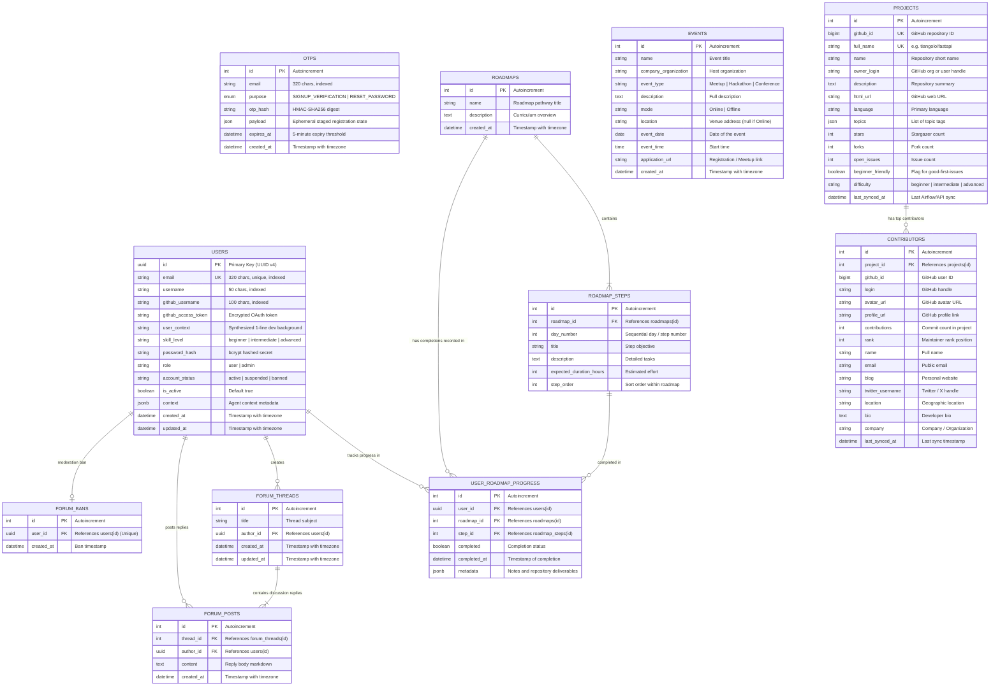
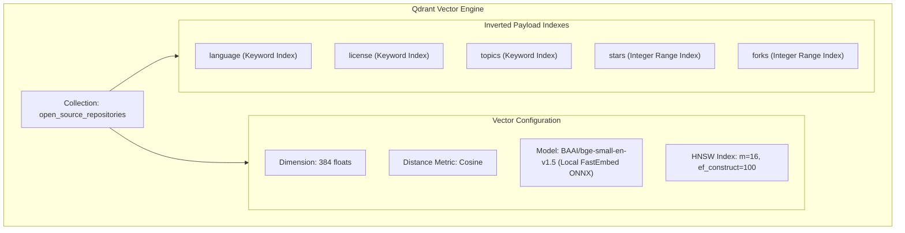

# Open Source Assist — Database Architecture & Design

This document details the complete relational and vector database topology for the **Open Source Assist** platform, covering the **PostgreSQL 15+** schema managed via SQLAlchemy 2.0 (Async) & Alembic, alongside the **Qdrant Vector Database** collection schema.

---

## 1. High-Level Entity-Relationship (ER) Diagram

The following diagram details all relational entities, primary keys, foreign keys, unique constraints, and cardinalities.



---

## 2. Table Schemas & Constraints Reference

### A. Authentication & Identity Subsystem

#### `users`
Primary user identity and developer skill context record.
* **`id`**: `UUID` (Primary Key, auto-generated v4).
* **`email`**: `VARCHAR(320)` (Unique, Indexed, Case-Insensitive Lowercase).
* **`username`**: `VARCHAR(50)` (Indexed, Optional for guests).
* **`github_username`**: `VARCHAR(100)` (Indexed, Links to verified GitHub account).
* **`github_access_token`**: `VARCHAR(255)` (Personal GitHub OAuth Bearer token).
* **`user_context`**: `VARCHAR(2000)` (Concise 1-line developer summary synthesized by Gemini LLM during skill evaluation).
* **`skill_level`**: `VARCHAR(50)` (`beginner`, `intermediate`, `advanced`, `expert`).
* **`password_hash`**: `VARCHAR(255)` (Bcrypt salted password hash).
* **`role`**: `VARCHAR(20)` (Default `'user'`, `'admin'` for platform administrators).
* **`account_status`**: `VARCHAR(20)` (Default `'active'`, `'suspended'`, `'banned'`).
* **`is_active`**: `BOOLEAN` (Default `true`).
* **`context`**: `JSONB` / `JSON` (Extensible agent metadata cache).
* **`created_at`** / **`updated_at`**: `TIMESTAMPTZ` (Auto-updated server timestamps).

#### `otps`
Ephemeral key-value token table for verification and password recovery.
* **`id`**: `INTEGER` (Primary Key, Autoincrement).
* **`email`**: `VARCHAR(320)` (Indexed).
* **`purpose`**: `VARCHAR(32)` (`SIGNUP_VERIFICATION`, `RESET_PASSWORD`).
* **`otp_hash`**: `VARCHAR(64)` (HMAC-SHA256 hex digest; plain text OTP is never stored).
* **`payload`**: `JSON` (Pending signup attributes such as pre-hashed password and username).
* **`expires_at`**: `TIMESTAMPTZ` (5-minute expiration window).
* **`created_at`**: `TIMESTAMPTZ` (Creation timestamp).
* **Constraint**: `UNIQUE (email, purpose)` — only one active code per purpose exists at any moment.

---

### B. Projects & Contributor Ecosystem

#### `projects`
Cached and synced open-source GitHub repositories.
* **`id`**: `INTEGER` (Primary Key, Autoincrement).
* **`github_id`**: `BIGINT` (Unique, Indexed; GitHub API internal repository ID).
* **`full_name`**: `VARCHAR(255)` (Unique, Indexed; e.g. `'tiangolo/fastapi'`).
* **`name`**: `VARCHAR(255)` (Short repository name).
* **`owner_login`**: `VARCHAR(255)` (Indexed; Owner organization or user handle).
* **`description`**: `TEXT` (Repository summary).
* **`html_url`**: `VARCHAR(500)` (Web URL).
* **`language`**: `VARCHAR(100)` (Primary programming language).
* **`topics`**: `JSON` (Array of topic tags).
* **`stars`**: `INTEGER` (Stargazer count).
* **`forks`**: `INTEGER` (Fork count).
* **`open_issues`**: `INTEGER` (Open issues count).
* **`beginner_friendly`**: `BOOLEAN` (Flag for good-first-issues availability).
* **`difficulty`**: `VARCHAR(20)` (`beginner`, `intermediate`, `advanced`).
* **`last_synced_at`**: `TIMESTAMPTZ` (Timestamp of last GitHub sync).

#### `contributors`
Maintainers and top contributors parsed from GitHub repository commit graphs.
* **`id`**: `INTEGER` (Primary Key, Autoincrement).
* **`project_id`**: `INTEGER` (Foreign Key -> `projects.id` with `CASCADE` delete).
* **`github_id`**: `BIGINT` (Indexed).
* **`login`**: `VARCHAR(255)` (Indexed).
* **`avatar_url`** / **`profile_url`**: `VARCHAR(500)`.
* **`contributions`**: `INTEGER` (Number of merged contributions).
* **`rank`**: `INTEGER` (Rank order in repo).
* **`name`**, **`email`**, **`blog`**, **`twitter_username`**, **`company`**: `VARCHAR(255)`.
* **`location`**: `VARCHAR(255)` (Indexed for regional contributor discovery).
* **`bio`**: `TEXT`.
* **`last_synced_at`**: `TIMESTAMPTZ`.
* **Constraint**: `UNIQUE (project_id, github_id)` — ensures idempotent sync per repository.

---

### C. Community Events

#### `events`
Upcoming open-source hackathons, workshops, and meetups.
* **`id`**: `INTEGER` (Primary Key, Autoincrement).
* **`name`**: `VARCHAR(255)` (Indexed; Event title).
* **`company_organization`**: `VARCHAR(255)` (Indexed; Hosting entity).
* **`event_type`**: `VARCHAR(100)` (Indexed; `'Meetup'`, `'Hackathon'`, `'Conference'`).
* **`description`**: `TEXT`.
* **`mode`**: `VARCHAR(50)` (Indexed; `'Online'` or `'Offline'`).
* **`location`**: `VARCHAR(500)` (Null if mode is Online).
* **`event_date`**: `DATE` (Indexed).
* **`event_time`**: `TIME`.
* **`application_url`**: `VARCHAR(1000)` (Registration or meeting link).
* **`created_at`**: `TIMESTAMPTZ`.

---

### D. Roadmaps & Progression Tracking

#### `roadmaps`
Curated technical contribution roadmaps.
* **`id`**: `INTEGER` (Primary Key, Autoincrement).
* **`name`**: `VARCHAR(255)` (Roadmap title).
* **`description`**: `TEXT`.
* **`created_at`**: `TIMESTAMPTZ`.

#### `roadmap_steps`
Sequential milestone steps inside a roadmap pathway.
* **`id`**: `INTEGER` (Primary Key, Autoincrement).
* **`roadmap_id`**: `INTEGER` (Foreign Key -> `roadmaps.id` with `CASCADE` delete).
* **`day_number`**: `INTEGER` (Day or sequential sequence number).
* **`title`**: `VARCHAR(255)` (Step objective).
* **`description`**: `TEXT` (Deliverables and guidance).
* **`expected_duration_hours`**: `INTEGER` (Estimated effort).
* **`step_order`**: `INTEGER` (Display sort order).
* **Constraint**: `UNIQUE (roadmap_id, day_number)`.

#### `user_roadmap_progress`
User completion tracking table.
* **`id`**: `INTEGER` (Primary Key, Autoincrement).
* **`user_id`**: `UUID` (Foreign Key -> `users.id` with `CASCADE` delete, Indexed).
* **`roadmap_id`**: `INTEGER` (Foreign Key -> `roadmaps.id` with `CASCADE` delete, Indexed).
* **`step_id`**: `INTEGER` (Foreign Key -> `roadmap_steps.id` with `CASCADE` delete, Indexed).
* **`completed`**: `BOOLEAN` (Default `false`).
* **`completed_at`**: `TIMESTAMPTZ` (Null until completed).
* **`metadata`**: `JSONB` / `JSON` (Notes, PR links, or verification artifacts).
* **Constraint**: `UNIQUE (user_id, roadmap_id, step_id)`.

---

### E. Community Forum & Discussions

#### `forum_threads`
Discussion topics initiated by community members.
* **`id`**: `INTEGER` (Primary Key, Autoincrement).
* **`title`**: `VARCHAR(200)` (Thread heading).
* **`author_id`**: `UUID` (Foreign Key -> `users.id` with `CASCADE` delete, Indexed).
* **`created_at`** / **`updated_at`**: `TIMESTAMPTZ`.

#### `forum_posts`
Threaded replies and code reviews.
* **`id`**: `INTEGER` (Primary Key, Autoincrement).
* **`thread_id`**: `INTEGER` (Foreign Key -> `forum_threads.id` with `CASCADE` delete, Indexed).
* **`author_id`**: `UUID` (Foreign Key -> `users.id` with `CASCADE` delete, Indexed).
* **`content`**: `TEXT` (Markdown formatted post).
* **`created_at`**: `TIMESTAMPTZ`.

#### `forum_bans`
Forum-scoped moderation bans.
* **`id`**: `INTEGER` (Primary Key, Autoincrement).
* **`user_id`**: `UUID` (Foreign Key -> `users.id` with `CASCADE` delete, Unique, Indexed).
* **`created_at`**: `TIMESTAMPTZ`.
* **Constraint**: `UNIQUE (user_id)`.

---

## 3. Qdrant Vector Database Topology

For sub-millisecond semantic search, repository metadata is vectorized and stored in a standalone **Qdrant Vector Database** instance.



### Document Vector Synthesis Formula
Every repository document embedding combines repository semantics into a unified representation:

$$\text{Representation} = \text{Full Name} \;\Vert\; \text{Language} \;\Vert\; \text{Topics} \;\Vert\; \text{Description} \;\Vert\; \text{README Summary}$$

### Payload JSON Schema
```json
{
  "repo_id": 89229960,
  "full_name": "tiangolo/fastapi",
  "html_url": "https://github.com/tiangolo/fastapi",
  "description": "FastAPI framework, high performance, easy to learn, fast to code, ready for production",
  "language": "Python",
  "stars": 75420,
  "forks": 6400,
  "open_issues": 412,
  "license": "MIT",
  "topics": ["fastapi", "asyncio", "python", "rest-api"],
  "pushed_at": "2026-09-20T14:32:00Z",
  "readme_summary": "High performance ASGI web framework built with Starlette and Pydantic."
}
```

---

## 4. Maintenance & Operations

* **Schema Migrations**: Managed using Alembic:
  ```powershell
  uv run alembic upgrade head
  ```
* **Periodic OTP Purge Task**: Runs as an async background task inside FastAPI's application lifespan loop (`backend/main.py`), automatically issuing `DELETE FROM otps WHERE expires_at < NOW()` every 60 seconds.
* **Cascade Invariants**: Deleting a `User` cascades to their forum posts, threads, roadmap progress, and bans. Deleting a `Project` cascades to all associated maintainer `Contributor` records.
